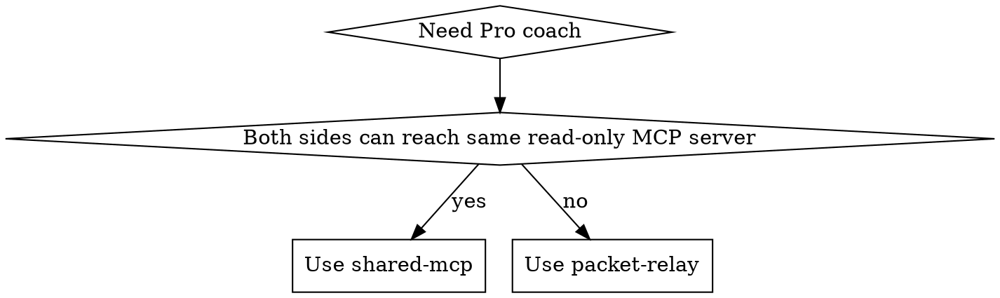

# Pro Coach Bridge

## Overview

Treat ChatGPT Pro as a coach, not an executor. Keep code edits, shell commands, and local truth in the execution host. Bridge only the smallest evidence packet Pro needs to reason well.

If the current Codex task is a repo-local coding delivery and the user explicitly invokes `$ship`, prefer `ship` for the delivery workflow. Use this skill when the hard part is the coach bridge itself: shared context, packet design, and evidence relay.

## Choose Topology

- Use `shared-mcp` when the execution host and ChatGPT Pro can both read the same MCP tools.
- Use `packet-relay` when ChatGPT Pro cannot reach the live local context directly.
- Never treat a personal ChatGPT conversation as a bidirectional transport bus for another model.

## Shared MCP

1. Expose the same read-only context to both sides.
2. Keep the tool surface narrow. Good defaults are:
   - `read_repo_summary`
   - `read_current_diff`
   - `read_logs`
   - `read_design_notes`
   - `search_code`
3. Do not expose write, delete, install, commit, or shell-execution tools to the coach path.
4. Tell Pro exactly which tools exist and what role it should play.
5. After Pro replies, translate accepted guidance into a local execution brief before any implementation starts.

Use `shared-mcp` for the highest-fidelity coaching because both sides see the same artifacts, but keep it read-only so the execution owner remains clear.

## Packet Relay

1. Build one compact evidence packet locally.
2. Send that packet to ChatGPT Pro through the browser surface or manual paste.
3. Wait for one focused coach reply.
4. Convert the accepted advice into a local execution brief.
5. Run the local agent or host from that brief.
6. Send one follow-up packet only if another coach round is necessary.

Use `packet-relay` when the execution host cannot share live tools with ChatGPT Pro, or when a static packet is safer than exposing live context.

## Evidence Rules

Always include:
- goal
- repo/worktree or system scope
- constraints
- current state
- observed failures or unknowns
- key files with `file:line`
- exact asks

Always avoid:
- whole-file dumps when a summary plus evidence is enough
- private secrets
- speculative claims about local state
- asking Pro to execute code it cannot see or verify

Local verified evidence wins over coach speculation. If Pro advice conflicts with repo instructions, code, or command output, keep the local truth and ask a narrower follow-up only if needed.

## What To Ask Pro For

Good coach asks:
- frame the problem
- identify the highest-risk failure modes
- compare two or three design options
- propose task sequencing
- define success criteria
- define test expectations
- critique a draft design or diff summary

Bad coach asks:
- "implement this for me"
- "trust that this local stack trace is complete"
- "decide without repo constraints"

## Working Agreement

- ChatGPT Pro is the coach.
- The execution host is the owner.
- The bridge agent curates evidence and translates guidance.
- Pro never counts as proof that local code is correct.
- One good packet beats five vague packets.

## Reference

Read `references/coach-packets.md` for ready-to-paste kickoff and follow-up templates.
