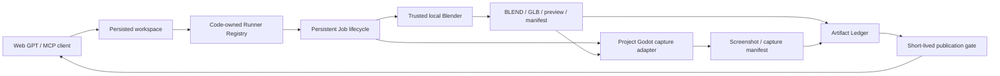

# Game Art Production V1

DevSpace Game Art Production V1 adds a bounded, traceable Blender-to-Godot
review loop to the existing MCP workspace and background Job model. It is not a
DCC control plane, an art generator, or an OS sandbox.

## Architecture



The existing `start_job`, `poll_job`, and `cancel_job` tools remain authoritative
for process state. Blender is one registered runner, not a separate process
manager. `start_capture` is a small profile-loading front end that starts the
same Job model with an approved Godot runner.

## Web GPT workflow

1. Call `list_workspaces` and `resume_workspace` after reconnecting, or
   `open_workspace` once for a new checkout/worktree.
2. Create or edit one workspace-local Blender Python script with normal file
   tools.
3. Call `start_job` with `runner: "blender"`, a conservative background
   argument array, and narrow `artifactRoots`.
4. Poll until the Job and artifact state are terminal.
5. Use `list_artifacts` to inspect versioned SHA-256 records.
6. Call `start_capture` with a project-owned
   `.devspace/captures/<profile>.json`.
7. Poll, list the screenshot/manifest, then call `publish_artifact` for the
   specific registered version needed for review.
8. Inspect the short-lived image URL and iterate by editing project scripts.

Example Blender arguments:

```json
[
  "--background",
  "--factory-startup",
  "--offline-mode",
  "--disable-autoexec",
  "--python-exit-code",
  "23",
  "--python",
  "tools/create_asset.py"
]
```

`--python-exit-code` must precede `--python`; Blender applies command-line
options in order. The fixture uses one workspace-local script to create a
simple multi-level tower ship, save `source.blend`, export `ship.glb`, render
`preview_perspective.png`, and write `asset_manifest.json`.

## Persistence and recovery

Workspace sessions, terminal Jobs, bounded logs, artifact baselines, and
versioned Artifact Ledger records live in the private DevSpace state directory.
After restart:

- `list_workspaces` exposes only sessions still allowed by the current root
  policy;
- `resume_workspace` restores the original opaque Workspace ID;
- `poll_job` and `list_artifacts` recover finished records and relationships;
- a Job persisted as running/cancelling becomes `interrupted`, never
  `succeeded`;
- private PID/PGID and random process-identity metadata lets a restarted POSIX
  server verify and terminate the surviving recorded process group with TERM
  followed by forced KILL;
- valid partial artifacts are scanned and marked incomplete;
- publication tokens are gone and the reviewer must request a new URL.

V1 does not reconnect to a running external process after a DevSpace restart.
It terminates attached children on orderly shutdown and records
`JOB_INTERRUPTED`; after an unclean restart it validates private persisted
PID/PGID and random identity metadata, terminates the verified surviving POSIX
process group, preserves the prior evidence, and requires a new validation run.
Older state written before process identity persistence can still be marked
interrupted but cannot be retroactively killed.

## Error contract

Tool errors and Job snapshots use stable codes before human-readable detail:

| Code | Meaning |
| --- | --- |
| `RUNNER_UNAVAILABLE` | Runner is disabled, unsupported, missing, or not executable. |
| `RUNNER_ARGUMENT_REJECTED` | Argument policy or shell/path syntax failed. |
| `WORKSPACE_ESCAPE` | Canonical path or symlink leaves the workspace. |
| `ARTIFACT_NOT_FOUND` | Version is absent, stale, missing, or changed. |
| `ARTIFACT_MIME_REJECTED` | Signature/content does not match a supported format. |
| `ARTIFACT_TOO_LARGE` | Ledger or publication size cap was exceeded. |
| `PUBLISH_TOKEN_EXPIRED` | Short-lived artifact token passed its expiry. |
| `JOB_TIMEOUT` | Runner exceeded its approved timeout. |
| `JOB_CANCELLED` | Client cancellation reached a terminal state. |
| `JOB_INTERRUPTED` | DevSpace stopped/restarted during execution. |
| `BLENDER_FAILED` | Blender exited unsuccessfully. |
| `HOUDINI_FAILED` | Hython or hbatch exited unsuccessfully. |
| `CAPTURE_PROFILE_INVALID` | Capture profile/schema/path/limit validation failed. |
| `CAPTURE_FAILED` | Project capture adapter or Godot exited unsuccessfully. |

Job snapshots expose `errorCode` separately from `error`. Runner and
pre-execution validation failures retain their stable prefix in the MCP error.
No response includes OAuth tokens, owner passwords, raw publication tokens
other than the explicitly requested URL, sensitive environment variables, or
local absolute artifact paths.

## Trust and responsibility

Blender Python, GDScript, package scripts, compilers, and test programs run with
the local user's authority. DevSpace provides `trusted_local` containment:
registered executables, reviewed argument policies, workspace and symlink
checks, bounded time/output/concurrency, process-group termination, declared
artifact roots, and post-run hashes. It does not provide an OS filesystem or
network sandbox.

Projects and their Skills own modeling logic, scene choice, camera, composition,
random seed, quality criteria, naming, provenance, and human art acceptance.
DevSpace owns safe selection/execution, traceability, preview publication, and
recovery. It should not decide whether a ship, character, animation, or effect
is aesthetically acceptable.

## End-to-end fixture

`npm run test:game-art-real` uses installed Blender and Godot Mono through the
real OAuth/MCP surface in a temporary Git workspace. It verifies:

- Blender produces native BLEND, GLB, PNG, and JSON outputs;
- Godot imports the new GLB with its runtime `GLTFDocument` API and renders a
  fixed 640x360 capture;
- both Blender preview and Godot screenshot URLs return bytes whose SHA-256
  matches the ledger;
- the capture manifest binds engine/version, scene, viewport, seed, frames,
  source commit, image digest, Job ID, and loaded asset;
- restart restores the old Workspace/Job/artifact relationship;
- the old publication URL is invalid and the same artifact can be republished
  with the same digest;
- temporary state is removed and no successful Job leaves Blender/Godot
  children running.

For detailed policy and configuration, see
[Runner Registry](runner-registry.md),
[Artifact Security](artifact-security.md), and
[Capture Profiles](capture-profiles.md).
